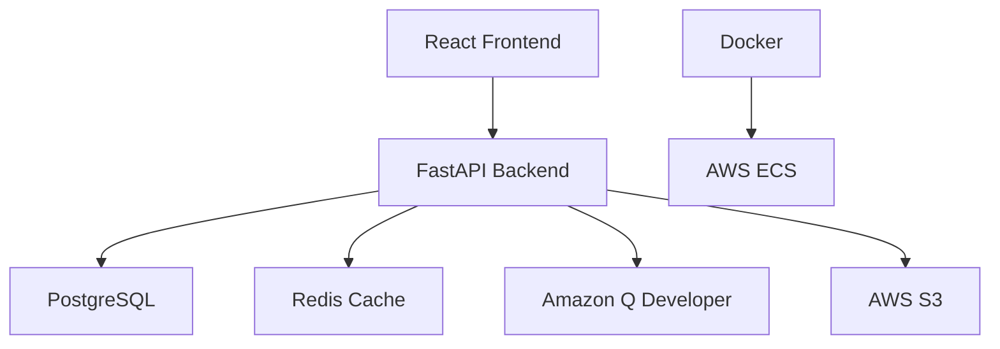

<div align="center">

# EdweavePack

**AI-Powered Educational Content Platform**

[](https://opensource.org/licenses/MIT)
[](https://www.python.org/downloads/)
[](https://reactjs.org/)
[](https://fastapi.tiangolo.com/)
[](https://www.docker.com/)
[](https://aws.amazon.com/)

Transform teaching resources into structured curricula, adaptive learning paths, and auto-graded assessments powered by **Amazon Q Developer** and **Kiro** agent orchestration.

[🚀 Quick Start](#quick-start) • [🎬 Demo Video](#demo) • [📖 Documentation](#documentation) • [🏗️ Architecture](#architecture)

</div>

## 🎬 Demo

**Watch EdweavePack in Action** (2-3 min demo)

[](demo/demo-script.md)

**Try it yourself:**
- 📄 [Sample Teaching Resources](demo/sample_resources.md)
- 🔧 [Demo Script & Setup](demo/demo-script.md)
- 📊 [Expected AI Outputs](demo/sample_resources.md#expected-ai-generated-outputs)
- 💾 [Sample Files](demo/sample-files/) - Python, Algebra, Biology content

## Features

<table>
<tr>
<td>

**AI Content Generation**
- Transform PDFs, text, videos into curricula
- Intelligent question generation
- Automated grading system

</td>
<td>

**Analytics & Insights**
- Real-time student progress tracking
- Performance analytics dashboard
- Adaptive learning recommendations

</td>
</tr>
<tr>
<td>

**Secure & Scalable**
- OAuth2 JWT authentication
- Enterprise-grade security
- AWS cloud infrastructure

</td>
<td>

**Modern Interface**
- Glassmorphism design system
- Responsive across devices
- Intuitive user experience

</td>
</tr>
</table>

## Architecture



**Tech Stack**
- **Backend**: FastAPI, PostgreSQL, Redis, Celery
- **Frontend**: React 18, Tailwind CSS, React Router
- **AI**: Amazon Q Developer, Kiro Agent Orchestration
- **Infrastructure**: AWS ECS, RDS, ElastiCache, S3
- **DevOps**: Docker, Terraform, GitHub Actions

## 📖 Documentation

- 🏗️ [Architecture Overview](docs/architecture.md)
- 🚀 [Setup Guide](docs/setup-guide.md)
- 🌐 [Deployment Guide](docs/deployment.md)
- 🤖 [Agent Orchestration](backend/agents/)
- 📊 [API Documentation](http://localhost:8000/docs)

## Quick Start

### Prerequisites

```bash
# Required
Docker & Docker Compose
Node.js 18+
Python 3.11+
AWS CLI (for deployment)
```

### Local Development

```bash
# Clone and setup
git clone https://github.com/your-org/EdweavePack.git
cd EdweavePack
cp .env.example .env

# Start all services
make up

# Or run demo with sample data
make demo
```

**Access Points**
- Frontend: http://localhost:3000
- API: http://localhost:8000
- Docs: http://localhost:8000/docs

### Manual Setup

<details>
<summary>Backend Development</summary>

```bash
cd backend
python -m venv venv
venv\Scripts\activate  # Windows
source venv/bin/activate  # Unix
pip install -r requirements.txt
uvicorn main:app --reload
```
</details>

<details>
<summary>Frontend Development</summary>

```bash
cd frontend
npm install
npm start
```
</details>

## API Documentation

### Core Endpoints

| Method | Endpoint | Description |
|--------|----------|-------------|
| `POST` | `/api/auth/register` | Teacher registration |
| `POST` | `/api/auth/token` | Authentication |
| `POST` | `/api/curriculum/` | Create curriculum |
| `GET` | `/api/curriculum/` | List curricula |
| `POST` | `/api/curriculum/upload` | Upload materials |
| `GET` | `/api/assessment/{id}` | Get assessment |
| `POST` | `/api/assessment/{id}/submit` | Submit answers |
| `GET` | `/api/analytics/dashboard` | Analytics data |

**Interactive Documentation**: Available at `/docs` when running locally

## Testing

```bash
# Run all tests
make test

# Individual test suites
make test-backend
make test-frontend
```

## Deployment

### Infrastructure

```bash
# Setup AWS credentials
aws configure

# Deploy with Terraform
cd infrastructure
terraform init && terraform apply
```

### CI/CD Pipeline

Push to `main` branch triggers:
1. Automated testing
2. Docker image build
3. ECR deployment
4. ECS service update

## Security

- **Authentication**: OAuth2 + JWT tokens
- **Transport**: HTTPS enforcement
- **Data**: Encryption at rest
- **Secrets**: AWS Secrets Manager
- **Validation**: Input sanitization
- **CORS**: Configured protection

## Contributing

1. Fork the repository
2. Create feature branch: `git checkout -b feature/name`
3. Commit changes: `git commit -m 'Add feature'`
4. Push branch: `git push origin feature/name`
5. Submit Pull Request

**Development Guidelines**
- Follow existing code style
- Add tests for new features
- Update documentation
- Ensure CI passes

## Roadmap

- [ ] Multi-language support
- [ ] Advanced ML analytics
- [ ] LMS integrations
- [ ] Mobile applications
- [ ] Real-time collaboration
- [ ] AI tutoring system

## License

MIT License - see [LICENSE](LICENSE) file for details.

## Support

- **Issues**: [GitHub Issues](https://github.com/your-org/EdweavePack/issues)
- **Documentation**: [docs/](docs/)
- **Demo**: [demo-script.md](demo/demo-script.md)

---

<div align="center">

**Built for educators worldwide**

</div>