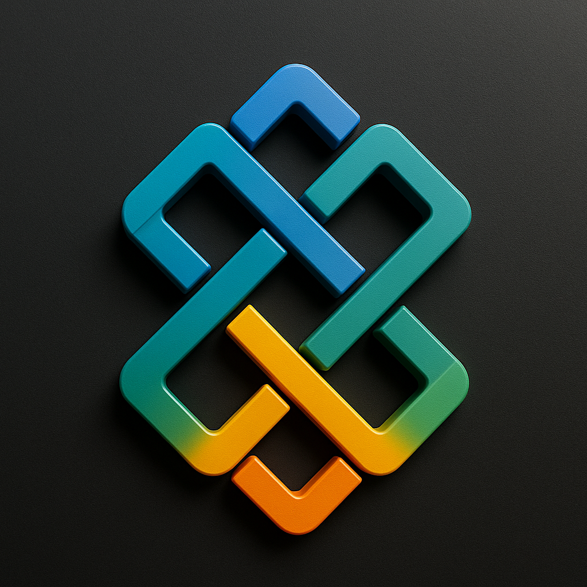
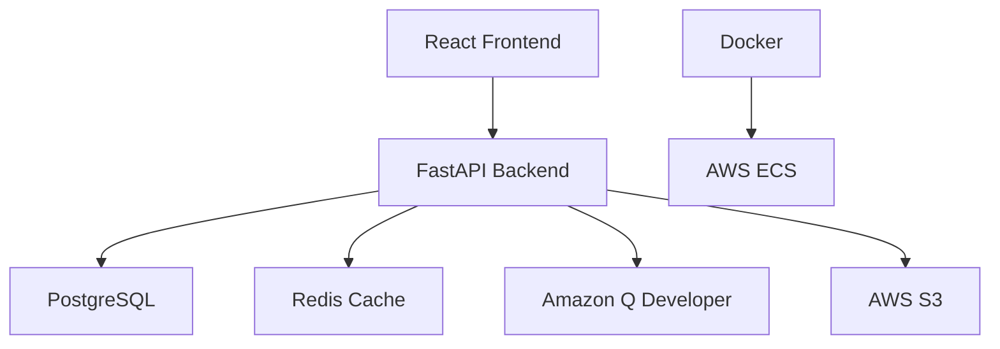

<div align="center">



# EdweavePack

**🎓 AI-Powered Educational Content Platform**

[](https://opensource.org/licenses/MIT)
[](https://www.python.org/downloads/)
[](https://reactjs.org/)
[](https://fastapi.tiangolo.com/)
[](https://www.docker.com/)
[](https://aws.amazon.com/)
[](http://edweavepack-prod-alb-2084837426.eu-north-1.elb.amazonaws.com)
[](https://dorahacks.io/hackathon/aws-global-vibe)

**🏆 AWS Global Vibe: AI Coding Hackathon 2025 Submission**

**Transform teaching resources into intelligent curricula with AI-powered content generation, adaptive learning paths, and automated assessments. Built with Amazon Q Developer and advanced agent orchestration for the AI in Education track.**

🌐 **[Live Demo](http://edweavepack-prod-alb-2084837426.eu-north-1.elb.amazonaws.com)** • 🚀 [Quick Start](#quick-start) • 📖 [Documentation](#documentation) • 🏗️ [Architecture](#architecture)

</div>

## 🌐 Live Application & Demo

**🏆 AWS Global Vibe Hackathon 2025 - AI in Education Track**

**EdweavePack is now live and fully operational!**

🔗 **Application URL**: [http://edweavepack-prod-alb-2084837426.eu-north-1.elb.amazonaws.com](http://edweavepack-prod-alb-2084837426.eu-north-1.elb.amazonaws.com)

**Test Credentials**:
- 📧 Email: `deploy_test@example.com`
- 🔑 Password: `TestPass123!`

### 🎯 Hackathon Demo Features
- ✅ **User Registration & Login** - Create your educator account
- 🤖 **Amazon Q Developer Integration** - AI-powered curriculum generation
- 📚 **Curriculum Creation** - Upload teaching materials and generate structured curricula
- 🧠 **AI Content Generation** - Transform PDFs, text, and videos into interactive content
- 📊 **Student Analytics** - Track learning progress and performance insights
- 🎯 **Assessment Tools** - Auto-generated quizzes and graded assignments
- 🔄 **Agent Orchestration** - Kiro-powered intelligent learning path generation

**Sample Resources**:
- 📄 [Sample Teaching Resources](demo/sample_resources.md)
- 🔧 [Demo Script & Setup](demo/demo-script.md)
- 📊 [Expected AI Outputs](demo/sample_resources.md#expected-ai-generated-outputs)
- 💾 [Sample Files](demo/sample-files/) - Python, Algebra, Biology content

## ✨ Key Features - Amazon Q Developer Integration

<table>
<tr>
<td>

**🤖 Amazon Q Developer AI Integration**
- **Code Generation**: Automated curriculum structure creation
- **Content Analysis**: AI-powered document processing
- **Question Generation**: Intelligent assessment creation
- **Code Assistance**: Development workflow optimization

</td>
<td>

**📚 AI Content Generation**
- Transform PDFs, text, videos into structured curricula
- Multi-format content support (documents, videos, URLs)
- Automated grading and feedback system
- Real-time content adaptation

</td>
</tr>
<tr>
<td>

**📊 Analytics & Insights**
- Real-time student progress tracking
- Performance analytics dashboard
- Adaptive learning path recommendations
- Misconception detection and remediation

</td>
<td>

**🔄 Agent Orchestration (Kiro)**
- Curriculum architect agent
- Learning path generator
- Personalized learning recommendations
- Multi-agent collaboration system

</td>
</tr>
<tr>
<td>

**🔒 Secure & Scalable AWS Infrastructure**
- OAuth2 JWT authentication system
- Enterprise-grade security (HTTPS, encryption)
- AWS ECS, RDS, S3 integration
- Auto-scaling and high availability

</td>
<td>

**🎨 Modern Educational Interface**
- Glassmorphism design system
- Fully responsive across all devices
- Intuitive drag-and-drop interactions
- Accessibility-compliant UI/UX

</td>
</tr>
</table>

## Architecture



**🏆 Hackathon Tech Stack**
- **AI Integration**: **Amazon Q Developer** (Primary), **Kiro Agent Orchestration**
- **Backend**: FastAPI, PostgreSQL, Redis, Celery
- **Frontend**: React 18, Tailwind CSS, React Router
- **Infrastructure**: AWS ECS Fargate, RDS PostgreSQL, S3, ALB
- **DevOps**: Docker, Terraform, GitHub Actions, ECR
- **Security**: JWT Authentication, CORS, HTTPS-ready

## 📖 Documentation

- 🏗️ [Architecture Overview](docs/architecture.md)
- 🚀 [Setup Guide](docs/setup-guide.md)
- 🌐 [Deployment Guide](docs/deployment.md)
- 🤖 [Agent Orchestration](backend/agents/)
- 📊 [API Documentation](http://localhost:8000/docs)

## Quick Start

### Prerequisites

```bash
# Required
Docker & Docker Compose
Node.js 18+
Python 3.11+
AWS CLI (for deployment)
```

### Local Development

```bash
# Clone and setup
git clone https://github.com/reuben-idan/EdweavePack.git
cd EdweavePack
cp .env.example .env

# Start all services
make up

# Or run demo with sample data
make demo
```

**Access Points**
- Frontend: http://localhost:3000
- API: http://localhost:8000
- Docs: http://localhost:8000/docs

### Manual Setup

<details>
<summary>Backend Development</summary>

```bash
cd backend
python -m venv venv
venv\Scripts\activate  # Windows
source venv/bin/activate  # Unix
pip install -r requirements.txt
uvicorn main:app --reload
```
</details>

<details>
<summary>Frontend Development</summary>

```bash
cd frontend
npm install
npm start
```
</details>

## API Documentation

### Core Endpoints

| Method | Endpoint | Description |
|--------|----------|-------------|
| `POST` | `/api/auth/register` | Teacher registration |
| `POST` | `/api/auth/token` | Authentication |
| `POST` | `/api/curriculum/` | Create curriculum |
| `GET` | `/api/curriculum/` | List curricula |
| `POST` | `/api/curriculum/upload` | Upload materials |
| `GET` | `/api/assessment/{id}` | Get assessment |
| `POST` | `/api/assessment/{id}/submit` | Submit answers |
| `GET` | `/api/analytics/dashboard` | Analytics data |

**Interactive Documentation**: Available at `/docs` when running locally

## Testing

```bash
# Run all tests
make test

# Individual test suites
make test-backend
make test-frontend
```

## Deployment

### Infrastructure

```bash
# Setup AWS credentials
aws configure

# Deploy with Terraform
cd infrastructure
terraform init && terraform apply
```

### CI/CD Pipeline

Push to `main` branch triggers:
1. Automated testing
2. Docker image build
3. ECR deployment
4. ECS service update

## Security

- **Authentication**: OAuth2 + JWT tokens
- **Transport**: HTTPS enforcement
- **Data**: Encryption at rest
- **Secrets**: AWS Secrets Manager
- **Validation**: Input sanitization
- **CORS**: Configured protection

## Contributing

1. Fork the repository
2. Create feature branch: `git checkout -b feature/name`
3. Commit changes: `git commit -m 'Add feature'`
4. Push branch: `git push origin feature/name`
5. Submit Pull Request

**Development Guidelines**
- Follow existing code style
- Add tests for new features
- Update documentation
- Ensure CI passes

## Roadmap

- [ ] Multi-language support
- [ ] Advanced ML analytics
- [ ] LMS integrations
- [ ] Mobile applications
- [ ] Real-time collaboration
- [ ] AI tutoring system

## License

MIT License - see [LICENSE](LICENSE) file for details.

## 🚀 AWS Global Vibe Hackathon 2025

**🏆 Submission Details**
- **Track**: AI in Education
- **Primary Technology**: Amazon Q Developer
- **Secondary Technology**: Kiro Agent Orchestration
- **Submission Deadline**: December 1, 2025
- **Innovation Focus**: Transforming educational content creation with AI

**🎯 Hackathon Highlights**
- ✅ **Amazon Q Developer Integration**: Comprehensive AI-powered development workflow
- ✅ **Live Deployment**: Fully functional application on AWS infrastructure
- ✅ **Real-world Impact**: Addresses actual educational challenges
- ✅ **Technical Innovation**: Advanced agent orchestration and AI content generation
- ✅ **Scalable Architecture**: Enterprise-ready AWS cloud deployment

## 🚀 Deployment Status

**Production Environment**: ✅ **LIVE**
- **Frontend**: React application deployed on AWS ECS Fargate
- **Backend**: FastAPI service with PostgreSQL database
- **Infrastructure**: Fully automated with Terraform
- **Monitoring**: CloudWatch logs and health checks
- **Security**: CORS configured, HTTPS ready, JWT authentication

**Recent Updates**:
- ✅ Fixed CORS and network connectivity issues
- ✅ Resolved frontend-backend authentication flow
- ✅ Deployed with proper load balancer configuration
- ✅ Database tables created and functional
- ✅ All API endpoints tested and operational

## 📞 Support

- **Live Application**: [EdweavePack Platform](http://edweavepack-prod-alb-2084837426.eu-north-1.elb.amazonaws.com)
- **Issues**: [GitHub Issues](https://github.com/reuben-idan/EdweavePack/issues)
- **Documentation**: [docs/](docs/)
- **Demo Guide**: [demo-script.md](demo/demo-script.md)
- **API Docs**: [Interactive API Documentation](http://edweavepack-prod-alb-2084837426.eu-north-1.elb.amazonaws.com/docs)

---

<div align="center">


**🏆 AWS Global Vibe: AI Coding Hackathon 2025**

**Built for educators worldwide** 🌍

*Empowering teachers with Amazon Q Developer and AI-driven educational technology*

**[Try EdweavePack Live →](http://edweavepack-prod-alb-2084837426.eu-north-1.elb.amazonaws.com)**

**Submission Deadline: December 1, 2025** ⏰

</div>