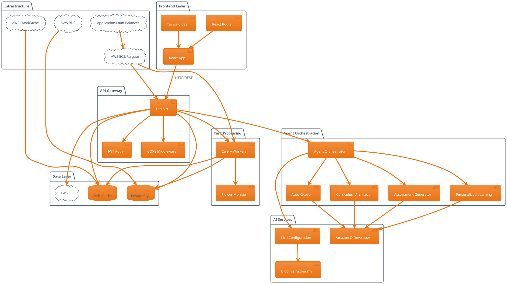
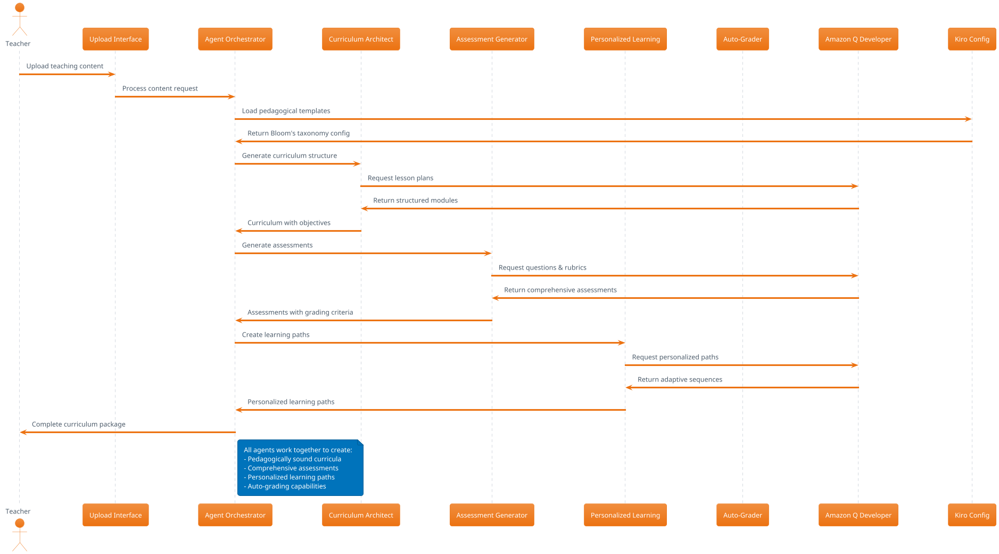

# EdweavePack Architecture

## System Overview

## Agent Workflow

## Technology Stack

### Backend
- **FastAPI**: High-performance Python web framework
- **PostgreSQL**: Primary database for structured data
- **Redis**: Caching and session management
- **Celery**: Asynchronous task processing
- **SQLAlchemy**: Database ORM
- **Alembic**: Database migrations

### Frontend
- **React 18**: Modern UI framework
- **Tailwind CSS**: Utility-first styling
- **React Router**: Client-side routing
- **Recharts**: Data visualization
- **Axios**: HTTP client

### AI & Agents
- **Amazon Q Developer**: Content generation
- **Kiro**: Pedagogical configuration
- **Agent Orchestrator**: Multi-agent coordination
- **Bloom's Taxonomy**: Educational framework

### Infrastructure
- **AWS ECS/Fargate**: Container orchestration
- **AWS RDS**: Managed PostgreSQL
- **AWS ElastiCache**: Managed Redis
- **AWS S3**: File storage
- **AWS ALB**: Load balancing
- **Docker**: Containerization

### Monitoring
- **CloudWatch**: Logging and metrics
- **OpenSearch**: Log analysis
- **Flower**: Celery monitoring
- **AWS X-Ray**: Distributed tracing

## Data Flow

1. **Content Upload**: Teachers upload PDFs, text, or video URLs
2. **Content Extraction**: AI extracts and analyzes educational content
3. **Agent Orchestration**: Four specialized agents process content
4. **Curriculum Generation**: Structured learning modules created
5. **Assessment Creation**: Comprehensive evaluations generated
6. **Personalization**: Adaptive paths for individual students
7. **Delivery**: Content delivered through responsive web interface
8. **Analytics**: Real-time tracking and insights

## Security Architecture

- **Authentication**: OAuth2 + JWT tokens
- **Authorization**: Role-based access control
- **Transport**: HTTPS/TLS encryption
- **Data**: Encryption at rest (RDS, S3)
- **Network**: VPC with private subnets
- **Secrets**: AWS Secrets Manager
- **Monitoring**: CloudTrail audit logs

## Scalability Design

- **Horizontal Scaling**: ECS auto-scaling groups
- **Database**: Read replicas for performance
- **Caching**: Multi-layer Redis caching
- **CDN**: CloudFront for static assets
- **Load Balancing**: Application Load Balancer
- **Async Processing**: Celery task queues